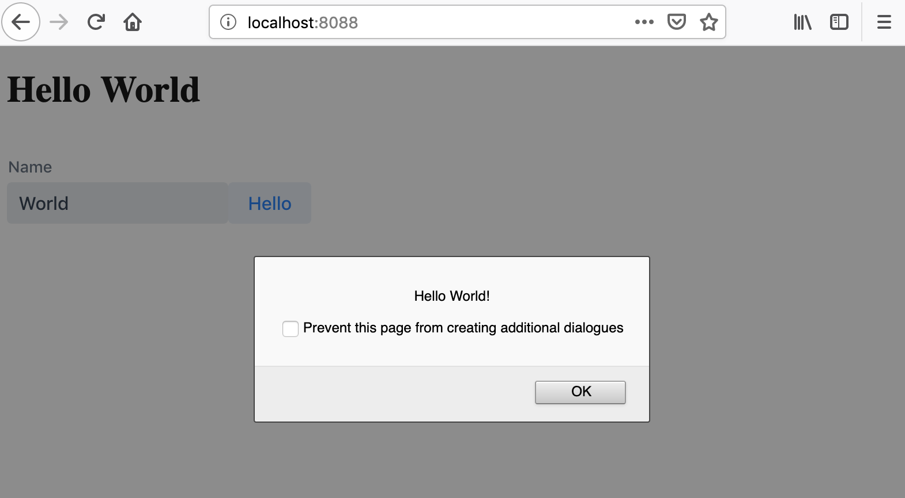

# Hello World: Vaadin Elements + Kotlin

## Building and Running

```
# First create the bundle
./gradlew bundle

# Run the webpack dev server
./gradlew run
```

Navigate to http://localhost:8088

When making changes, recreate the bundle

```
./gradlew bundle
```

## IDE

Any text based editor will do. The free **Intellij Community Edition** provides good support for gradle and kotlin.

## Final result


